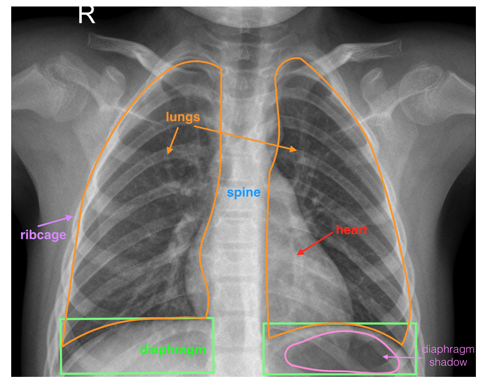
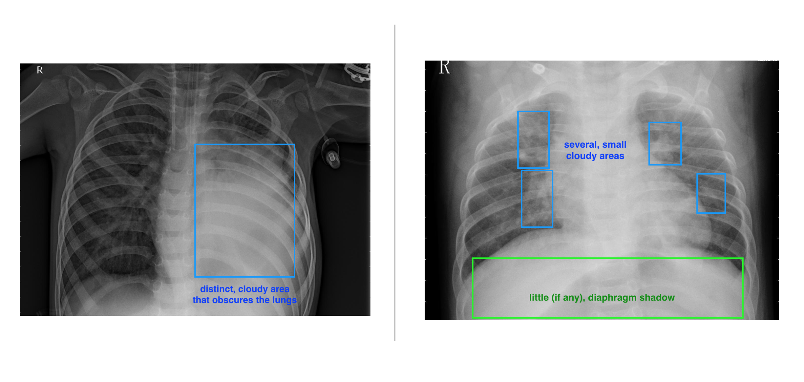
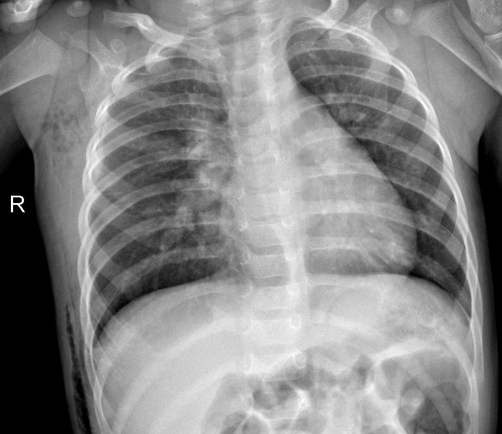
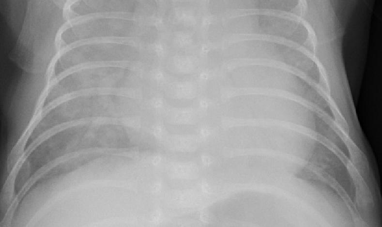
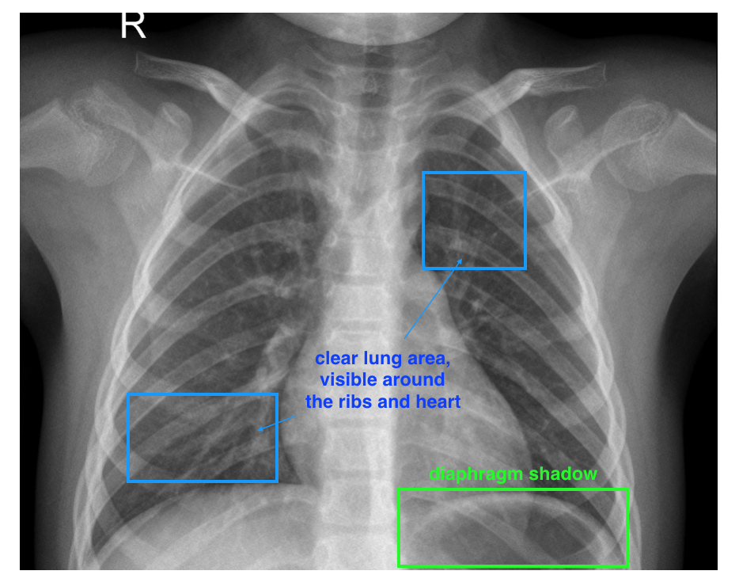

# Medical Image Annotation — Pneumonia Detection

A data-labeling capstone from the Duke AI Product Management program. The goal: help clinicians triage pediatric chest x-rays for pneumonia by building a labeled dataset and a quality-assured annotation job in [Appen](https://www.appen.com/).

**Evaluation framework for this project →** [`../notebooks/01_medical_image_annotation_evaluation.ipynb`](../notebooks/01_medical_image_annotation_evaluation.ipynb)

---

## Overview

### Project goal
Help medical professionals — particularly pediatricians — quickly identify cases of pneumonia in children using machine learning. The project covers the data-labeling side of that pipeline: sourcing x-rays, designing the annotation job, and quality-assuring the labels before they feed a downstream classifier.

---

## Data labels

### Labeling strategy
- **Initial data.** 101 images with two columns: `img_url` and `label`.
- **New column.** A third column, `title`, was added to prevent mislabeling and reduce job degradation caused by hyperlinked labels.
- **Examples.** Pneumonia-positive x-rays used as anchor examples for annotators:

---

## Test questions and quality assurance

### Test setup
Given the small dataset, **eight** test questions were developed. Each annotator completes a verification test every fifth image (5% test rate).

### Test question improvement
For any image labeled "Pneumonia," the job forces three accuracy questions:
1. Is this a healthy chest x-ray image?
2. Are you more than 50% confident the image shows signs of pneumonia?
3. Can you explain your decision to a medical professional?

---

## Contributor satisfaction

If annotator feedback dips below a **3.5/5** rating on test questions or instructions, those areas get revised. Focus is on clarity of instructions and whether the test questions give annotators a clear path to improve accuracy.

---

## Limitations and improvements

### Data biases
The dataset assumes every image is either healthy or pneumonia-related. Annotators can select **"Unknown"** when they can't confidently classify. Ambiguous cases (cloudy images, off-angle captures) were frequent enough to warrant this escape hatch:

### Designing for longevity
The labeling job is periodically retrained to adjust for new medical knowledge — new x-ray machine types, outlier cases (e.g., non-child x-rays), annotator feedback. A healthy baseline for comparison:

---

## Files in this folder

| File | What it is |
|---|---|
| [`README.md`](README.md) | This document. |
| [`0_project-proposal_sgardner.docx`](0_project-proposal_sgardner.docx) | Final project proposal, submitted version (embedded images). |
| [`0_project-proposal.docx`](0_project-proposal.docx) | Earlier proposal draft. |
| [`1_xray_image_data_extension_labeled.csv`](1_xray_image_data_extension_labeled.csv) | Final labeled dataset used for the Appen job. |
| [`xray_image_data.csv`](xray_image_data.csv) | Original 101-image dataset, two columns. |
| [`xray_image_data_extension.csv`](xray_image_data_extension.csv) | Extended dataset with the added `title` column. |
| [`xray_image_data_extension_labeled.csv`](xray_image_data_extension_labeled.csv) | Extended dataset, fully labeled. |
| [`preview_layout_example.html`](preview_layout_example.html) | Appen job layout preview (how annotators see the task). |
| [`example_preview.pdf`](example_preview.pdf) | PDF version of the layout preview. |
| [`How to create a job in Appen.pdf`](How%20to%20create%20a%20job%20in%20Appen.pdf) | Process documentation for Appen job creation. |
| [`This is how AI bias really happens...pdf`](This%20is%20how%20AI%20bias%20really%20happens—and%20why%20it%E2%80%99s%20so%20hard%20to%20fix%20%7C%20MIT%20Technology%20Review.pdf) | Reference reading (MIT Technology Review). |
| [`Medical Image Classification Submission/`](Medical%20Image%20Classification%20Submission/) | Final submission bundle for the capstone. |
| [`images/`](images/) | Figures used in this README and the proposal. |

---

**Author:** Stephen D. Gardner
