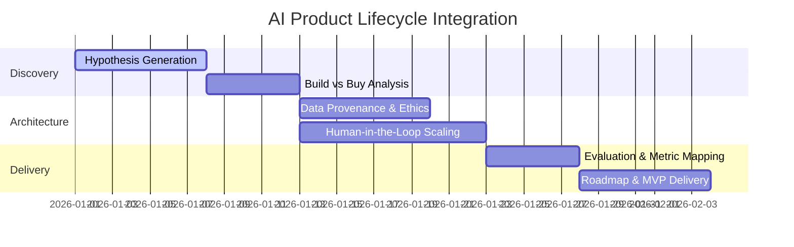

# AI Product Management 

## Executive Summary
This repository functions as a definitive playbook and portfolio highlighting comprehensive AI Product Management execution. It demonstrates a capacity to bridge empirical data science with commercial enterprise value, showcasing high-velocity methodologies for AI tool integration, model evaluation, and product lifecycle scoping. The objective is to establish predictable, ethical, and highly scaleable autonomous data product launches.

For a granular breakdown of the mathematical evaluation criteria (e.g., Precision, Recall) and data architecture decisions, please refer to [TECHNICAL.md](TECHNICAL.md).

## Implementation Lifecycle

## Key Portfolio Highlights
- **Automated Lifecycle Delivery**: Robust blueprints outlining minimum viable product (MVP) design docs and Agile execution milestones tailored explicitly for machine learning models.
- **Build vs. Buy Economics**: Empirical frameworks for evaluating open-source constraints against enterprise SaaS API architectures, determining infrastructural tipping points.
- **Medical Image Annotation Capstone**: A comprehensive real-world analysis translating raw classification metrics into safe clinical viability validation pipelines.
- **Ethical Mitigation Strategy**: Methodologies mapping historical dataset biases and predicting execution drift in dynamic production verticals.

## Repository Directory

| Area of Focus | Description | Enterprise Value |
| --- | --- | --- |
| **`Capstone Project`** | Medical Datasets & Clinical Pipelines | Architecting deployable classification models operating within highly sensitive compliance boundaries. |
| **`Bias & Fairness`** | Ethical Mitigation & Audits | Safeguarding consumer applications from long-tail systemic bias and uncontrolled model drift. |
| **`Build or Buy`** | Vendor Architecture & Cost Strategy | Accelerating time-to-market by isolating the most optimal vendor constraints and algorithmic customizations. |
| **`Data Labeling`** | MLOps & Orchestration | Setting up scaleable frameworks merging synthetic feedback with human-in-the-loop annotations. |
| **`Strategic Roadmap`** | Output Delivery | Driving iterative business impact across cross-functional engineering, UX, and marketing silos. |

## Usage
Explore module directories to access direct strategy documentation, operational frameworks, and comprehensive project evaluations spanning from initial inception to scalable enterprise deployments.

---
**Author:** Stephen D. Gardner
