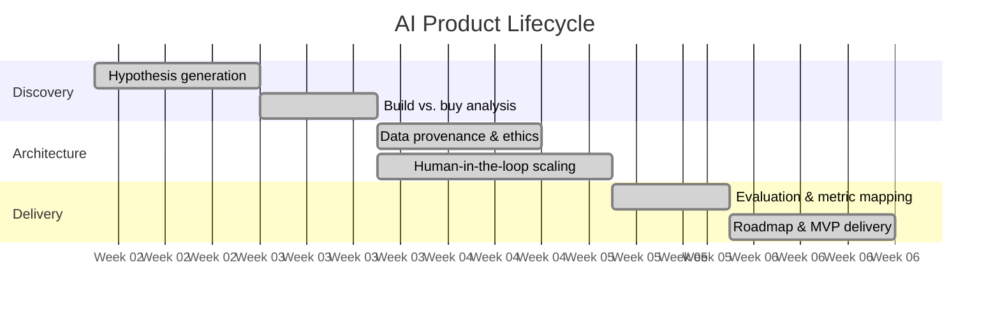

<p align="center">
  
</p>

<p align="center">
  <a href="https://stephengardnerd.github.io/AI_Product_Management"></a>
  <a href="notebooks/"></a>
  <a href="web/"></a>
</p>

---

## What this is

A portfolio from the **Duke University AI Product Management** program. Six workstreams — MVP design, build-vs-buy economics, evaluation frameworks, bias & fairness, MLOps data labeling, and strategic roadmapping — paired with **runnable Jupyter notebooks** so the methodology is code, not just claims.

Applied at production scale in [**explanova.ai**](https://explanova.ai) — a K–12 S.T.E.M. homework copilot I solo-built using these exact frameworks.

For mathematical detail on the evaluation criteria and data architecture decisions, see [TECHNICAL.md](TECHNICAL.md).

---

## In this repo

| Folder | Deliverable |
|---|---|
| [`Medical Image Annotation Project/`](Medical%20Image%20Annotation%20Project/) | **Capstone** — pediatric pneumonia detection, annotation job design, QA framework. |
| [`Google ML Project/`](Google%20ML%20Project/) · [`Google ML Project Submission/`](Google%20ML%20Project%20Submission/) | AutoML modeling report submitted to the Google ML program. |
| [`Capstone Project/`](Capstone%20Project/) | Starter materials for the capstone. |
| [`Minimum Viable Product/`](Minimum%20Viable%20Product/) | MVP design docs — user persona template, project overview. |
| [`Build or Buy/`](Build%20or%20Buy/) | Build-vs-buy reference materials. |
| [`Current AI and ML Products/`](Current%20AI%20and%20ML%20Products/) | Reference reading (CLIP paper, current-state ML research). |
| [`Starting AI Products/`](Starting%20AI%20Products/) | Reference guide — matching ML algorithms to scenario types. |
| [`coursework-mockups/`](coursework-mockups/) | Three exercise-scale mockups — MailGeniusAI, TastyCuts, Prioritization. |
| [`notebooks/`](notebooks/) | Three runnable Jupyter notebooks (see below). |
| [`web/`](web/) | Source for the React portfolio site. |
| [`scripts/`](scripts/) | Utility scripts. |

---

## Runnable notebooks

Three notebooks in [`/notebooks`](notebooks/) execute the frameworks on public/synthetic datasets:

| # | Notebook | What it does |
|---|---|---|
| 01 | [Medical Image Annotation Evaluation](notebooks/01_medical_image_annotation_evaluation.ipynb) | Per-class precision/recall/F1, confusion matrix, ROC, threshold sweep. |
| 02 | [Build vs. Buy Economic Model](notebooks/02_build_vs_buy_economic_model.ipynb) | 24-month TCO model, break-even curve, three-variable sensitivity analysis. |
| 03 | [Bias & Fairness Audit](notebooks/03_bias_fairness_audit.ipynb) | Demographic parity + equalized odds with reweighting mitigation. |

```bash
cd notebooks
pip install -r requirements.txt
jupyter notebook
```

All three run in under a minute on a laptop.

---

## Web UI

The [`/web`](web/) folder is a Vite + React 18 + TypeScript + Tailwind site that renders this portfolio at [**stephengardnerd.github.io/AI_Product_Management**](https://stephengardnerd.github.io/AI_Product_Management). GitHub Actions deploys automatically on every push to `main` that touches `web/`.

---

## Product lifecycle methodology

The end-to-end flow this portfolio was built against — discovery to delivery, with the workstreams each section of the repo exercises:



---

<p align="center">
  <sub><b>Author:</b> Stephen D. Gardner · <a href="https://github.com/stephengardnerd">@stephengardnerd</a> · <a href="https://explanova.ai">explanova.ai</a></sub>
</p>
<p align="center">
  <sub><a href="LICENSE">MIT Licensed</a></sub>
</p>
