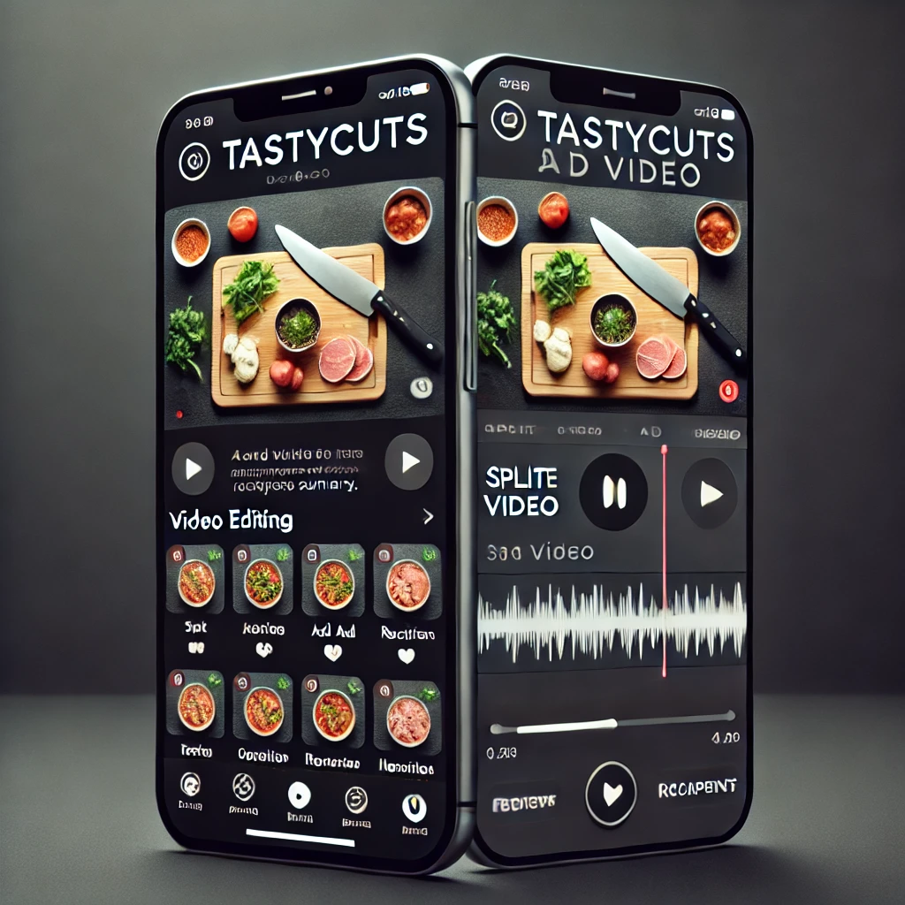

# TastyCuts: AI-Powered Video Creation App for Home Chefs

## Project Overview

TastyCuts is an AI-powered video creation tool designed to help home chefs create engaging, high-quality cooking videos with ease. As part of the TastyTube ecosystem, the platform leverages artificial intelligence to simplify the video editing process, enabling content creators to generate video captions, titles, descriptions, and recipe summaries, and even automate the division of cooking videos into distinct steps.

This project is aimed at reducing the complexity and time spent in editing cooking videos, making it easier for home chefs to focus on what they do best—cooking.

---

## Mockup



---

## Scenario

As the AI Product Manager at TastyTube, your role is to manage the development of a minimum viable product (MVP) that leverages AI to streamline the video editing process for home chefs. The key objective is to build a mobile application that allows creators to quickly generate and publish polished, engaging cooking videos with minimal manual effort.

### Key Challenge

The current bottleneck in TastyTube's ecosystem is the editing process, which is highly manual and time-consuming. Your task is to work with your team to identify, prioritize, and implement the core features needed to create an MVP that can reduce the video editing workload for content creators.

---

## Product Features

The features included in the initial version of the TastyCuts app were carefully selected using a RICE (Reach, Impact, Confidence, Effort) framework to ensure that only the most impactful and feasible features make it into the MVP. 

### Key Features:
- **Specify Dataset:** Retrieve the most popular videos from the TastyTube database to serve as the foundation for training AI models.
- **Conduct Exploratory User Research:** Identify the workflows and challenges faced by home chef content creators through research.
- **Prepare Data:** Manually split videos into step-by-step clips and apply labels to train the machine learning model.
- **Build ML Model:** Develop machine learning models that can automatically clip videos into individual steps and classify recipe steps.
- **Create App to Edit Clips and Text:** Develop a mobile app that allows creators to edit clips and text effortlessly.
- **Generate Video Titles, Descriptions, and Recipe Summaries:** Use an LLM to automatically generate metadata for videos.
- **Conduct Usability Testing:** Test the MVP with users to ensure it meets their needs.

---

## Product Prioritization

The following features were evaluated and prioritized based on the RICE scoring system to determine their importance to the MVP:

| Feature Name                                  | RICE Score | MVP | Rationale |
|-----------------------------------------------|------------|-----|-----------|
| Specify Dataset                               | 18         | Yes | Fundamental for training the AI model. |
| Conduct Exploratory User Research             | 15         | Yes | Helps understand user needs to build relevant features. |
| Create App to Edit the Clips and Text         | 12         | Yes | Core feature for user interaction and usability. |
| Build ML Model to Clip Video into Recipe Steps| 10         | Yes | Automates the most time-consuming aspect of video editing. |
| Generate Video Titles, Descriptions, and Summary | 8        | Yes | Provides automatic metadata generation to simplify the publishing process. |
| Conduct Usability Testing                     | 7          | Yes | Ensures the MVP meets the target users’ expectations. |
| Select and Instruct Labeling Team             | 5          | No  | Important for scaling, but not required for MVP. |
| Prepare Data (Splitting and Labeling)         | 4          | No  | Could be done manually initially to focus on the core feature set. |

---

## MVP Roadmap

The MVP roadmap was created using the CRISP-DM Agile framework with two-week sprints. Foundational tasks such as data preparation and model development are placed early in the sequence to ensure smooth development progress.

### Key Roadmap Features:

| Feature Name                                    | Sequence | # of Sprints | Team Resources                                         | Dependencies                     | Technical Skills OpenSource                | Technical Skills AWS        | Technical Skills Azure          | Technical Skills Google                  |
|-------------------------------------------------|----------|--------------|--------------------------------------------------------|-----------------------------------|--------------------------------------------|-----------------------------|---------------------------------|-----------------------------------------|
| **Conduct Exploratory User Research**           | 1        | 1            | UX Researchers, Product Manager                        | None                              | Survey tools, User research frameworks     | None                        | None                            | None                                    |
| **Specify Dataset**                             | 2        | 1            | Data Engineers, Product Manager                        | Conduct Exploratory User Research | SQL, Python, Pandas                       | Amazon S3                   | Azure Data Lake                   | Google Cloud Storage                    |
| **Select and Instruct Labeling Team**           | 3        | 1            | Data Annotators, Labeling Manager, Product Manager     | Specify Dataset                   | None                                     | None                        | None                            | None                                    |
| **Prepare Data: Split Videos into Clips**       | 4        | 2            | Data Engineers, Product Manager                        | Select and Instruct Labeling Team | Python, FFmpeg                            | Amazon S3, AWS Lambda       | Azure Data Lake, Azure Functions  | Google Cloud Storage, Google Functions  |
| **Prepare Data: Apply Labels**                  | 5        | 2            | Data Engineers, Labeling Team, Product Manager         | Split Videos into Clips           | SQL, Python, Labeling frameworks          | Amazon SageMaker Ground Truth | Azure Machine Learning           | Google Cloud AutoML                    |
| **Build ML Model to Clip Video into Individual Steps** | 6        | 3            | Data Scientists, ML Engineers, Product Manager         | Specify Dataset, Apply Labels     | Python, TensorFlow, PyTorch, OpenCV       | Amazon SageMaker             | Azure Machine Learning           | Google AI Platform                     |
| **Create App to Edit the Clips and Text**       | 7        | 4            | Mobile Developers, UI/UX Designers, Product Manager, Legal | Build ML Model to Clip Video       | React Native, Flutter                     | AWS Amplify                 | Azure App Service                | Firebase                                |
| **Generate Video Titles, Descriptions, and Recipe Summary** | 8        | 1            | Software Engineers, NLP Specialists, Product Manager  | Create App to Edit the Clips and Text | Python, NLTK, spaCy                      | Amazon Comprehend            | Azure Text Analytics              | Google Natural Language API            |
| **Conduct Usability Testing**                   | 9        | 1            | UX Researchers, QA Testers, Product Manager            | Create App to Edit the Clips and Text | Usability testing tools                  | None                        | None                            | None                                    |

---

## Getting Started

### Prerequisites

- Python 3.x
- TensorFlow / PyTorch for ML model development
- AWS / Azure / Google Cloud accounts for cloud-based data storage and processing

### Installation

1. Clone the repository:
   ```bash
   git clone https://github.com/username/tastycuts.git
